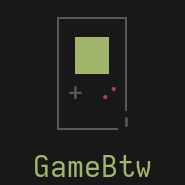

<h1 align="center">NNB's textart collections</h1>
<p align="center">The most ambitious textart collections</p>
<p align="center"></p>
<p align="center"> </p>
<p align="center">   </p>

## About

From [Fsymbols](https://fsymbols.com/text-art):

> ```
>    ▄▀▀▀▄▄▄▄▄▄▄▀▀▀▄   
>    █▒▒░░░░░░░░░▒▒█   
>     █░░█░░░░░█░░█    
>  ▄▄  █░░░▀█▀░░░█  ▄▄ 
> █░░█ ▀▄░░░░░░░▄▀ █░░█
> █▀▀▀▀▀▀▀▀▀▀▀▀▀▀▀▀▀▀▀▀█
> █  ╦ ╦╔╗╦ ╔╗╔╗╔╦╗╔╗  █
> █  ║║║╠ ║ ║ ║║║║║╠   █
> █  ╚╩╝╚╝╚╝╚╝╚╝╩ ╩╚╝  █
> █▄▄▄▄▄▄▄▄▄▄▄▄▄▄▄▄▄▄▄▄█
> ```
>
> **Text art**, also called ASCII art or keyboard art is a copy-pasteable digital age art form.
>
> It's about making text pictures with text symbols.

`.textart` is a [pure POSIX shell script](https://github.com/dylanaraps/pure-sh-bible) that print out textart.

###### [Learn how to create a `.textart` file here](https://github.com/NNBnh/textart-collections/wiki)

And this is my personal collection of `.textart` that I create and gather on [r/unixporn](https://www.reddit.com/r/unixporn) and other sources, all informations and credit of the particular textart are inside that file.

###### NOTE: This collections will not include textart that can be easily generated from pixel art, image, figlet,... or ASCII art with less than two colors.

## Contents
- [About](#about)
- [Contents](#contents)
- [Usage](#usage)
- [Resources](#resources)
  - [Textart Gallerys](#textart-gallerys)
  - [Character picker](#character-picker)
  - [Other textart scripts and tools](#other-textart-scripts-and-tools)
  - [Programs that use textart](#programs-that-use-textart)

## Usage
First [download](https://github.com/NNBnh/textart-collections/archive/main.zip) or clone this repo:

```sh
git clone https://github.com/NNBnh/textart-collections.git
```

`cd` to `textart-collections` directory:

```sh
cd path/to/textart-collections
```

then run any script that you want:

```sh
./script-name
```

E.g:

```sh
./gamebtw
```

Result:

```
 ┌───┐
 │▐█▌│
 │+ ⠔│
 └───'
GameBtw
```

## Resources
### Textart Gallerys
- [Text Art](https://fsymbols.com/text-art) and [Small Simple Text Art](https://fsymbols.com/text-art/twitter)
- [ASCII Art Gallery](https://textfancy.com/gallery)
- [ASCII Art Archive](https://asciiart.eu)
- [ASCII World](https://asciiworld.com)
- [Christopher Johnson's ASCII Art Collection](https://asciiart.website)
- [Roy/SAC Art Galleries](http://www.roysac.com/galleries.html)

### Character picker
- [Unicode search](http://xahlee.info/comp/unicode_index.html)
- [Symbols Emoji](https://fsymbols.com)
- [Character picker](https://textfancy.com/characters)

### Other textart scripts and tools
- [Color Scripts](https://github.com/stark/Color-Scripts): User contributed color scripts
- [Venam's ASCII/ANSI-Arts](https://github.com/venam/Ascii-Arts) by [Venam](https://github.com/venam)
- [`bonsai.sh`](https://gitlab.com/jallbrit/bonsai.sh): Bonsai tree generator
- [FIGlet](http://www.figlet.org) and [TOIlet](https://github.com/cacalabs/toilet): Text banner generator
- [Chafa](https://hpjansson.org/chafa): Image to ASCII/ANSI converter
- [Boxes](https://boxes.thomasjensen.com): Draws ASCII art boxes around your input text
- [`pipes.sh`](https://github.com/pipeseroni/pipes.sh): Animated pipes terminal screensaver
- [ASCIIQuarium](https://robobunny.com/projects/asciiquarium/html): An aquarium/sea animation in ASCII art

### Programs that use textart
- [Bfetch](https://github.com/NNBnh/bfetch): Dynamic fetching tool that SuperB
- [Neofetch](https://github.com/dylanaraps/neofetch): A command-line system information tool written in bash 3.2+
